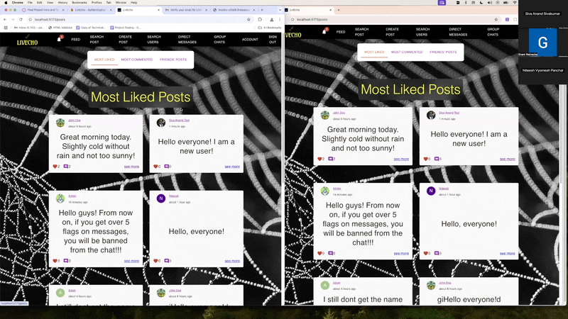
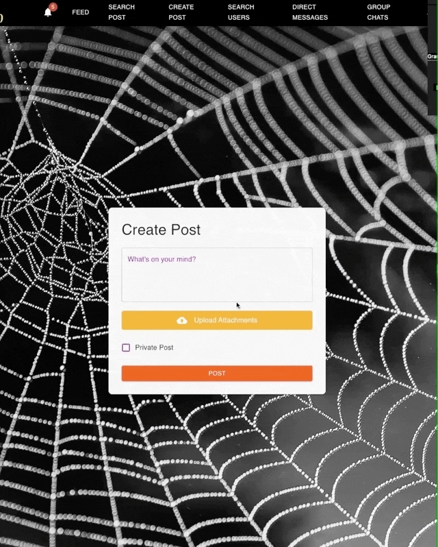
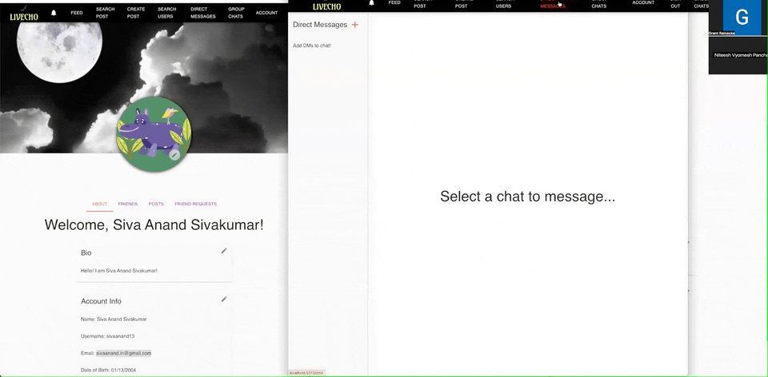
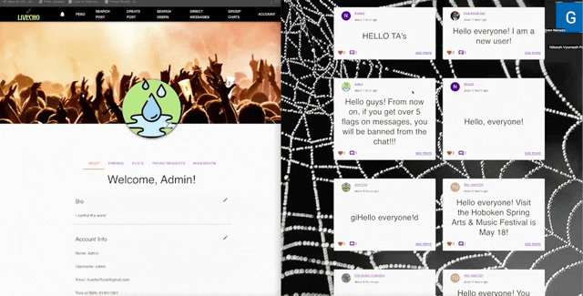
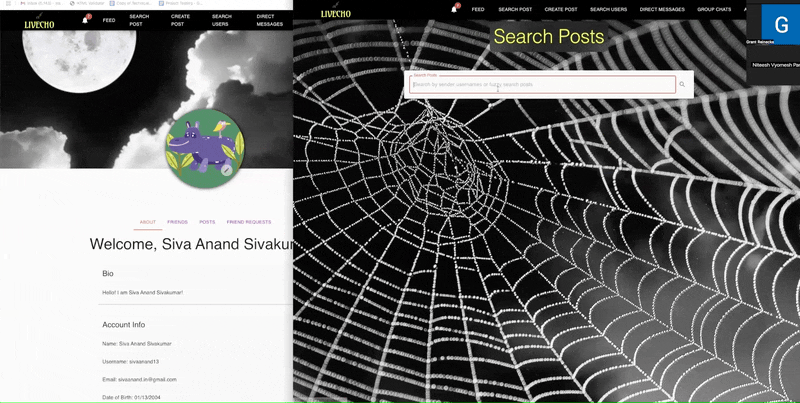
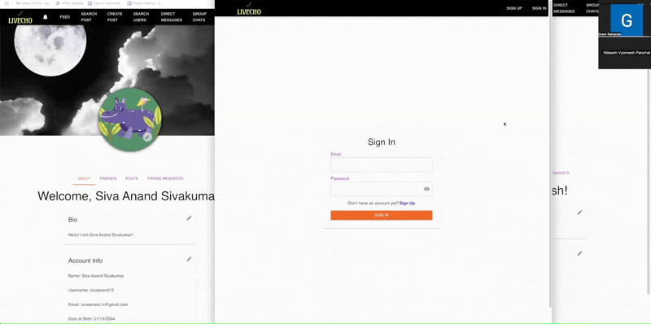
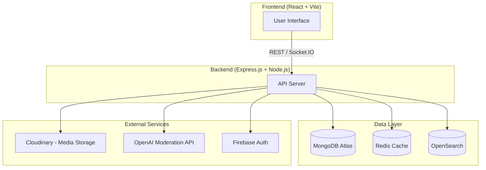

# LivEcho

LivEcho is a real-time social platform designed to explore scalable feed generation, low-latency messaging, and distributed search. It enables users to share content, interact through posts and comments, and communicate via direct and group chats, while integrating caching, event-driven updates, and content moderation to simulate production-grade social media architecture.


## Demo

### Feed & Trending Posts


Displays trending feed sections including most liked, most commented, and friends’ posts.

---

### Post Creation & Media Upload


Shows creating a post with text, image upload, and visibility settings.

---

### Real-time Chat


Demonstrates real-time messaging using Socket.IO with synchronized updates across multiple clients without page refresh.

---

### Moderation Workflow & Event-Driven Notifications


A user report triggers a moderation threshold, automatically generating a real-time notification for admin review.

---

### Search System


Demonstrates filtering and searching posts and users with instant results.

---

### Authentication & Email Verification


Demonstrates user registration with email-based verification, ensuring account authenticity before enabling full platform interactions.

## Key Features

- Post, edit, and remove posts with image attachments and visibility options
- Feed page with trending posts
- Search for posts and users with filters
- Friends management for sharing private posts
- Real-time notifications (Socket.IO)
- Private messaging (DMs) and group chats
- Text and image moderation (OpenAI Moderation)
- Account management (profile, banner, bio, username, email, password)

## Architecture Overview



## System Design Highlights

- **Data modeling & validation:** Mongoose schemas enforce domain-level validation and structure across users, posts, and messages  
- **Real-time system:** Socket.IO powers messaging, notifications, and feed updates without polling
- **Caching layer:** Redis reduces database load for frequently accessed posts
- **Search engine:** OpenSearch provides scalable full-text search beyond MongoDB indexing  
- **Media pipeline:** Cloudinary + Sharp handle storage and image optimization  
- **Moderation flow:** Content is validated via OpenAI before persistence to prevent unsafe data from entering the system  

## Modules & Technologies

### Backend
- **Node.js**, **Express.js** (API server)
- **MongoDB** (Mongoose ODM)
- **Redis** (caching)
- **Firebase Admin SDK** (auth)
- **Cloudinary** (image storage)
- **OpenAI Moderation API** (content moderation)
- **OpenSearch/Elasticsearch** (search)
- **Socket.IO** (real-time chat/notifications)
- **Sharp** (image processing)
- **Multer** (file uploads)
- **XSS** (input sanitization)

### Frontend
- **React** (with Vite)
- **Material UI (MUI)**
- **Zustand** (state management)
- **Firebase JS SDK**
- **Socket.IO client**
- **Axios** (API calls)
- **Email validation libs**
- **Day.js**, **date-fns** (date utils)

## Getting Started

The app has five main components: the React + Vite frontend, the Express API backend, MongoDB Atlas, OpenSearch, and Redis Cloud.

Follow the instructions below to set up the frontend and backend environments, including the required `.env` files.

### Prerequisites

**Backend .env variables:**

- PORT
- MONGO_URI
- CLOUDINARY_CLOUD_NAME
- CLOUDINARY_API_KEY
- CLOUDINARY_API_SECRET
- FIREBASE_TYPE
- FIREBASE_PROJECT_ID
- FIREBASE_PRIVATE_KEY_ID
- FIREBASE_PRIVATE_KEY
- FIREBASE_CLIENT_EMAIL
- FIREBASE_CLIENT_ID
- FIREBASE_AUTH_URI
- FIREBASE_TOKEN_URI
- FIREBASE_AUTH_PROVIDER_X509_CERT_URL
- FIREBASE_CLIENT_X509_CERT_URL
- FIREBASE_UNIVERSE_DOMAIN
- OPENAI_API_KEY
- ELASTICSEARCH_CLOUD_ID
- ELASTIC_USERNAME
- ELASTIC_PASSWORD
- REDIS_USERNAME
- REDIS_PASSWORD
- REDIS_HOST
- REDIS_PORT
- ADMIN_ID
- ADMIN_UID

**Frontend .env variables:**

- VITE_FIREBASE_KEY
- VITE_FIREBASE_DOMAIN
- VITE_FIREBASE_PROJECT_ID
- VITE_FIREBASE_STORAGE_BUCKET
- VITE_FIREBASE_SENDER_ID
- VITE_FIREBASE_APP_ID
- VITE_BACKEND_URI
- VITE_ADMIN_ID
- VITE_ADMIN_UID

### Installation

To install backend dependencies and run the server:

```sh
cd backend
npm install
npm start
```

To install frontend dependencies and run the app:

```sh
cd frontend
npm install
npm start
```